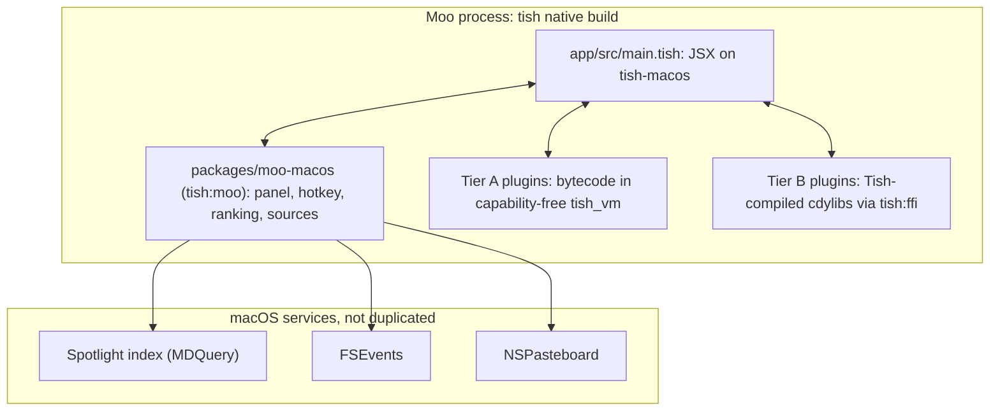

# Architecture

Moo is one native macOS process built from Tish. There are no Node hosts, no webviews and no
JavaScript running anywhere. This page describes what is built today and where it is heading.

## Process layout



A planned third tier runs untrusted native plugins in a sandboxed `moo-plughost` helper (also a
Tish binary) over a Unix-socket RPC. It does not exist yet.

## Code map

| Path | What it is |
| --- | --- |
| `app/src/main.tish` | The launcher: state, search composition, plugin loading, key handling, view |
| `app/src/theme.tish` | The whole look: colours, type, radii, icons, glass tints, panel geometry, motion |
| `packages/moo-macos` | Rust native module imported as `tish:moo` |
| `  src/mac.rs` | Panel, focus, key routing, Carbon hotkeys and the recorder, launch, icons, status item (click shows the panel, right click opens Settings… / Quit) |
| `  src/theme.rs` | Holds the theme set from Tish (`setTheme`) and resolves its colours; no values of its own |
| `  src/keys.rs` | Key names, hotkey spec parsing and display (`cmd+shift+k` → ⇧⌘K) |
| `  src/keymap.rs` | Per-keyboard modifier remaps and macOS system shortcut conflicts |
| `  src/shortcuts.rs` | `shortcuts.json`: parse, validate, save, templates (portable) |
| `  src/cli.rs` | Unix-socket server and the `moo` command-line client |
| `  src/shell.rs` | Shell shortcuts: `/bin/sh` on a worker thread, capped output, timeout |
| `  src/index.rs` | App index and nucleo fuzzy ranking (portable) |
| `  src/fsindex.rs` | File name index: crawl, search, rescan, snapshot (portable) |
| `  src/fslive.rs` | File index service: background build, FSEvents updates, saves |
| `  src/files.rs` | Spotlight file search on a worker thread (fallback while indexing); metadata search (size, dates, kind, folder, words in the text) for the AI's `findFiles`; content search for Search Files |
| `  src/fileops.rs` | Move to Trash, the apps that open a file, open with one of them |
| `  src/sysinfo.rs` | OS, hardware, disk and battery facts for the AI's `systemInfo` tool |
| `  src/system.rs` | System commands for `systemCommand`: lock, sleep, restart / shut down / log out (Apple Events to loginwindow), empty Trash, dark mode, volume and mute (CoreAudio), eject, hide / quit all apps; running apps with memory use and switch / hide / quit / force quit for Running Apps. `MOO_SYSTEM_DRY_RUN=1` makes every command only report what it would do |
| `  src/ax.rs` | Accessibility: arrange the frontmost app's focused window (remembers the frame for Restore), selected text for `{selection}`, replacing a typed snippet keyword, permission check |
| `  src/snippets.rs` | Snippet keywords: the characters typed in other apps since the cursor last jumped, matched against expanding text shortcuts |
| `  src/layout.rs` | Window layouts as pure geometry: halves, quarters, thirds, maximize, center, moving to another display |
| `  src/calc.rs` | Calculator: arithmetic, percentages, units, currency, number bases |
| `  src/dict.rs` | Word definitions: Dictionary Services text for every homograph (the private record functions, looked up at run time, with the public first-homograph call as fallback), parsed into senses, examples and origin |
| `  src/websearch.rs` | Search suggestions: an engine's OpenSearch JSON over URLSession (portable parser) |
| `  src/contacts.rs` | Contacts: access status and request, name search and the full list (Contacts framework); embeds the usage description the bare dev binary needs in `__TEXT,__info_plist` |
| `  src/rates.rs` | ECB exchange rates, fetched on a background thread and cached for 12 h (`MOO_RATES`) |
| `  src/tz.rs` | Time zone answers ("time in tokyo", "3pm pst to cet") on `NSTimeZone` |
| `  src/watch.rs` | FSEvents on the application folders |
| `  src/frecency.rs` | Use counts with decay, persisted as TSV (portable) |
| `  src/history.rs` | Recent searches for Spotlight's ↑ list, newest first (portable) |
| `  src/clip.rs` | Clipboard history |
| `  src/vmplug.rs` | Tier A loader: runs a bytecode chunk in a VM with no capabilities |
| `web/` | The moo.moi site: landing page and the sign-in relay, a native Tish HTTP server (see [web.md](web.md)) |
| `plugins/` | Example plugins (`utils` is Tier B, `convert` is Tier A) and `build.sh` |
| `vendor/tish-apple` | Vendored tish-macos, pointed at the same tish checkout (see below) |
| `scripts/` | Vendoring, `.app` bundling, UI drive scripts used for testing |
| `poc/`, `patches/` | FFI and Lattish proofs of concept; patches to tish and Lattish |

## The panel

macOS 14 and later ignore activation requests from background apps, even from a hotkey handler.
A launcher therefore has to take keystrokes without activating, which only an `NSPanel` with
`NonactivatingPanel` does. tish-macos creates a plain `NSWindow`, and re-classing it to `NSPanel`
crashes because AppKit's KVO observers are bound to the original class. So `adopt_into_panel`
moves tish-macos's root view into Moo's own panel and leaves the host window offscreen with a
same-size placeholder (tish-macos measures layout from its window's content view).

All styling lives in Tish, in `app/src/theme.tish`, so a theme can be swapped without touching
Rust. The views in `main.tish` take their colours, type sizes, weights, radii and icons from
`THEME`; `setTheme(THEME)` (called before `setup`, and again at any time to restyle the open panel)
hands the native side the panel's part: corner radius, margin, position, glass style, spacing and
tints, the pre-macOS 26 vibrancy material, tint, edge and shadow, and every opening and morph
timing. `theme.rs` only stores and applies it; without a theme the panel is plain (square,
untinted, no animation). Colours are AppKit semantic names (`label`, `controlAccent`, which follow
light and dark mode) or `#RRGGBB` / `#RRGGBBAA`, and panel colours may be `{ light, dark }`. The
numbers below are the current theme's.

The panel follows macOS Spotlight (see [raycast-overview.md](raycast-overview.md#spotlight-patterns)):
a borderless, clear window (a small `NSPanel` subclass, since AppKit refuses key status to
borderless windows), 36 pt larger than the panel's shape on every side. Behind the root view there
is one Liquid Glass view (`NSGlassEffectView`) per piece of the shape, all in one
`NSGlassEffectContainerView`, so pieces that come within 6 pt of each other melt into one shape.
Before macOS 26 (or with `MOO_NO_GLASS=1`) each piece is a rounded, tinted vibrancy view with a
hairline edge. `refresh_edge` applies the theme's tints for light or dark mode on every show: light
on the bar, denser on the results panel so the desktop does not fight the text.

`setPanelShape(height, [[x, width, radius], ...])` resizes the panel, keeping its top edge, and
cuts it into pieces: the idle bar is 52 pt tall, made of a field capsule and four circles; the
expanded panel is one rounded rectangle. The pieces are only the glass backdrop: everything on them,
including the category buttons' icons and the tab selection, is drawn by the Tish view, whose
columns line up with the pieces. tish-macos still lays the tree out at full height (it re-sizes the root view to
the host's placeholder on every commit); a top-anchored (flipped) container keeps the header at the
top and the panel clips the rest.

Opening springs the pieces into place: the field grows from its centre in both directions and the
circles spring out of its right end, farthest first, 16 ms apart; the Tish view fades in from
0.09 s to 0.19 s, as the circles reach the places its icons sit in. The spring is damped (0.18 s
period, damping ratio 0.58, about 11% overshoot, which the window's margin leaves room for) and is
stepped on a 120 Hz timer that sets the glass views' frames, so the glass re-shapes and melts every
frame rather than being scaled as a picture. Changing shape (bar to panel and back) morphs the same
way with a slower, softer spring (0.42 s, damping 0.78, 0.6 s): pieces in both shapes move, the
others fade in or out where they are, and the window keeps the taller height until it settles.
`MOO_NO_ANIMATION=1` turns both off.

In the idle bar Tab and Shift-Tab move a selection from the field through the four circles and back
(`shell.bubble`); the selected circle is filled with the system accent colour (`controlAccent`)
with a white icon, Return opens its category and Escape returns to the field. Typing clears it, and
so does showing the panel. `moo key <name>` feeds a key name to the same handler for scripting
and tests.

The Tish view keeps one fixed shape in every state: a header (icon, a borderless search field
`<textinput bezeled={false} fontSize placeholder>` added to the vendored tish-macos, and four
category buttons that collapse to 1 pt columns when expanded), 13 list slots, 4 grid rows of 7
icons, and a footer with up to three key-cap hints. Each list slot is a result row, a section
heading or filler, and filler takes the leftover height so the list height never changes. A
different shape would make tish-macos rebuild the views instead of patching them, and the search
field would lose focus. When a rebuild does happen anyway (the first render after launch, or
Spotlight results arriving), every native → Tish callback runs through `mac::with_ui`, which
gives focus back to the search field, caret at the end, if the panel was left with nothing
focused. Footer key caps are clickable and do what their key does.

Applications is a grid by default, like Spotlight: every app A–Z (typing ranks matches), a 64 pt
icon over its name, cut in the middle when long. The grid rows are 1 pt tall in every other view;
in the grid the slots shrink to the heading and the rows share the list's height. ⌘L (or its
footer key cap) switches between grid and list, and the choice is kept in `prefs.tsv`
(`MOO_PREFS`, next to `history.txt`). While the grid shows, `setArrowKeys(true)` makes the key
monitor deliver ← and → too; ↑↓ move by a row and the grid scrolls by rows.

Workspace app icons load lazily: an image view draws a dashed placeholder and is not told when the
real icon arrives. Every icon is therefore drawn once offscreen when it is first registered, one
per main-loop turn (about 15 ms each, so all apps take a few seconds after launch), starting with
all apps A–Z when the index is built. When that queue empties with the panel open, Tish gets
`onKey("icons")` and redraws.

Other consequences of being an accessory app:

- There is no Edit menu, so Cmd/Ctrl+C, V, X, Z, Shift+Z and Cmd+A are sent down the responder
  chain by hand (`edit_shortcut`).
- Up, down, enter (also ⌘↵ and ⌥↵), escape, tab and shift-tab, ⌘1–⌘4, ⌘R, ⌘L and ⌫ in an empty
  field (plus left and right while the Applications grid shows) are caught by a local key monitor
  and delivered to Tish as `onKey`.
- The panel hides when it loses key status. Because the window is clear, AppKit would send clicks
  on its transparent pixels (nearly all of it: glass is composited by the window server) to the
  window below, so the panel sets `ignoresMouseEvents = false` explicitly to take every click; its
  content view (`PanelStage`) hides the panel for clicks that miss the glass, as a click outside.

**Callbacks into Tish never run inside an AppKit or Carbon handler.** They are queued and flushed
from a main-queue block under `run_with_current_root`, because a callback that calls `setState`
re-renders the tree synchronously.

## Search

Every source answers the same query. Synchronous sources render immediately; asynchronous ones
arrive later, keyed by query, so stale results are dropped.

- **Apps:** the application folders are scanned in about 1 ms and kept in memory. FSEvents on
  those folders, coalesced over 2 s, triggers a rescan. Nothing is written to disk.
- **Commands:** built-ins plus each plugin's `manifest()` commands, ranked with the same matcher.
- **Files:** Moo's own name index (`fsindex.rs`, kept live by `fslive.rs`), answered
  synchronously on the main thread in 0.7–3.6 ms over ~600K entries. See "File index" below.
  While it builds, or in the rare moment it is applying changes, the query goes to Spotlight
  (`files.rs`, an in-process `MDQuery` on a worker thread, 65–760 ms) instead.
- **Ranking:** nucleo match score plus a frecency boost of `20 * ln(1 + score)`, where each use
  adds 1 and the score halves every 7 days. An empty query lists used items first.
- **Clipboard history:** AppKit posts no pasteboard notifications, so a 0.5 s timer compares
  `changeCount` and reads contents only when it moves. Text only, in memory, 200 items. Items
  typed `org.nspasteboard.ConcealedType`, `TransientType` or `AutoGeneratedType` are skipped.

The rule behind all of these: never write to disk per change. The frecency file is written once
per opened item, and the file-index snapshot at most once a minute while files change.

### File index

Spotlight answers in 65–760 ms and ranks by content as much as by name, so file search has its
own index of names. Measured on a home folder with 605,739 entries (43,532 folders):

| | |
| --- | --- |
| First crawl | 1.1 s (3.2 s with a cold disk cache), utility QoS, throttled I/O |
| Startup from snapshot | 54 ms (16.9 MB file at `~/Library/Caches/Moo/files.idx`) |
| Memory | 17–18 MB (about 30 bytes per entry) |
| Query | 0.7–3.6 ms (8 threads above 100K entries) |
| Idle CPU | 0 ms over 10 s |
| Change latency | about 1 s |

- **Layout:** struct of arrays (parent, name offset/length, flags, depth, a 32-bit letter/digit
  mask) over one deduplicated names buffer. The mask rejects most entries before any string
  compare.
- **What is indexed:** the home folder and iCloud Drive. Skipped: hidden entries, `~/Library`,
  `node_modules`, `target`, `Pods`, `DerivedData` and similar, and the insides of packages (`.app`,
  `.photoslibrary`, `.xcodeproj`, ...). A folder deeper than two levels with more than 5,000
  entries is indexed but its contents are not (generated data, caches). Entries under `vendor`,
  `third_party`, `build`, `dist` and similar rank lower but are kept.
- **Matching:** every query word must match the name or a parent folder's name, and at least one
  must match the name, so "moo docs" finds `~/Projects/moo/docs`. Exact name, stem, prefix
  and word-start matches score highest; shorter names and shallower paths win ties. When there
  are fewer substring hits than wanted, nucleo fuzzy-matches up to 3,000 mask-filtered candidates
  ("scrnsht"). The top 64 are re-ranked by frecency (×8) and modification time.
- **Staying current:** FSEvents at folder granularity on the roots, with `~/Library` excluded by
  the kernel (`FSEventStreamSetExclusionPaths`). A change rescans that folder's direct children;
  "must scan subdirs" rescans the subtree; a root change recrawls. Removed entries are marked dead
  and compacted away when they reach 20%.
- **Restarts:** the snapshot stores the FSEvents event id it is current to. At launch Moo loads
  it and asks FSEvents for everything since, so changes made while it was not running are
  replayed instead of recrawled.
- **Never blocking typing:** searches take a non-blocking read lock. If the event queue holds the
  write lock at that instant, the search falls back to Spotlight for that keystroke.

`MOO_FILE_ROOTS` (colon-separated) replaces the roots and `MOO_FILE_INDEX` the snapshot
path, for testing. `cargo test real_home_live -- --ignored --nocapture` measures the numbers above
and `live_index_follows_changes` checks FSEvents updates on a temporary folder.

## Shortcuts, hotkeys and the command line

Modelled on Universal Launcher: a shortcut is a keyword bound to a target, and the text typed after
the keyword fills the target's template. Typing `g rust traits` runs the `g` shortcut with
"rust traits".

**Shortcuts** live in `~/.config/moo/shortcuts.json` (`$XDG_CONFIG_HOME` and `MOO_CONFIG`
override it). The file is meant to be edited by hand and shared:

```json
{
  "launcher": "cmd+space",
  "shortcuts": [
    { "keyword": "g", "name": "Google", "kind": "url", "target": "https://www.google.com/search?q={query}" },
    { "keyword": "dl", "name": "Downloads", "kind": "open", "target": "~/Downloads", "hotkey": "ctrl+alt+d" },
    { "keyword": "ip", "name": "Public IP", "kind": "shell", "target": "curl -s ifconfig.me", "output": "copy" },
    { "keyword": "sig", "name": "Signature", "kind": "text", "target": "Best,\nAnn ({date})" }
  ],
  "hotkeys": [
    { "keys": "cmd+shift+v", "run": "moo:clipboard" },
    { "keys": "f5", "run": "g", "query": "weather" }
  ],
  "aliases": { "moo:clipboard": "cb", "/Applications/Safari.app": "sf" },
  "disabled": ["moo:dictionary", "/System/Applications/Chess.app"],
  "keys": { "settings": "cmd+;", "hideapp": "none" }
}
```

| Kind | Target | Runs |
| --- | --- | --- |
| `url` | URL template | Opens it; inserted text is percent-encoded |
| `open` | Path or app, `~` allowed | Opens it with the default app |
| `command` | Command id (`moo list commands`) | Opens the command; `input` (default `{query}`) becomes its search text |
| `shell` | `/bin/sh` command | Runs it; inserted text is single-quoted, so it is one argument and never code. `output`: `show` (default), `copy` or `none` |
| `text` | Text template | Copies it |

Templates take `{query}` (or `{}`), `{clipboard}`, `{date}` and `{time}`. A shortcut whose template
has `{query}` and is run without text puts `keyword ` in the launcher and waits for the rest.
Invalid entries are skipped with a warning, not fatal. Moo watches the folder with FSEvents
and reloads within half a second of a save. It writes the file atomically (temporary file and
rename), one shortcut per line, so diffs stay readable.

In the launcher, "Create Shortcut" walks through kind, target (with app and file search for
`open`, command search for `command`), keyword, name and hotkey, suggesting a name and keyword
from the target. "Shortcuts" lists them: ↵ runs, ⌘↵ edits, ⌥↵ copies `moo run <keyword>`, ⌘⌫
twice deletes.

**Hotkeys.** Each entry is registered with Carbon `RegisterEventHotKey`. The hotkey id maps to a
binding, and the binding's action reaches Tish as `onHotkey("hk:<index>")`. The launcher's own
hotkey toggles the panel directly, without a round trip through Tish. Every key on an ANSI
keyboard can be used (letters, digits, punctuation, return, space, delete, arrows, F1–F20, home,
end, page up and down). A hotkey needs ⌘, ⌃ or ⌥ unless it is an F key. Before registering,
Moo checks:

- that another entry does not already use the same combination, however it is spelled
  (`shift+cmd+k` equals `cmd+shift+k`), naming the owner: "⌃⌥⇧F18 is already bound to
  “Downloads”";
- that the combination is not an enabled macOS shortcut, which macOS would accept and then never
  deliver. This covers every shortcut stored in `com.apple.symbolichotkeys` plus the Space-bar
  defaults (Spotlight, input sources, Finder search) that are only stored once changed;
- the keyboards' modifier remaps, as for the launcher (see building.md).

The command line refuses a conflicting hotkey before saving. A hand-edited conflict is shown as
"not active" with its reason in `moo list hotkeys`, `moo status` and the Shortcuts list.
The recorder in Create Shortcut turns on `set_recording`, so the panel's key monitor sends the
next combination to Tish as `record:<spec>` instead of typing it.

**Hotkeys and Aliases.** Settings › Hotkeys and Aliases (also the `moo:hotkeys` command) is one
table of everything that can have a key: the launcher hotkey, the panel keys, every command
grouped by plugin, the shortcuts and every app, with Alias and Hotkey columns. ↵ records a hotkey;
⌘K sets or removes the alias, removes the hotkey, and disables or enables the row. The other
entries in `shortcuts.json` hold these choices:

- `aliases` maps a command id (`moo list commands`) or an app path to one word. Typing the word
  shows that command as the top hit; text after it becomes the command's search text. An alias
  can't be a shortcut keyword or another command's alias. A shortcut's alias is its keyword.
- `disabled` lists command ids, app paths and `shortcut:<keyword>`. Disabled rows are hidden from
  search, and their hotkeys are not registered. They stay in the table, marked "Off".
- `keys` overrides the keys that work while the panel is open. The actions are `actions` (⌘K),
  `settings` (⌘,), `category1`–`category4` (⌘1–⌘4), `appsview` (⌘L), `quicklook` (⌘Y),
  `reveal` (⌘R), `openwith` (⌘O) and `hideapp` (⌘H). `none` turns one off. Tish passes the
  resulting list to `setPanelKeys`; the key monitor only intercepts those combinations and sends
  them as `panel:<spec>`. The labels in footers and action lists follow the overrides.

macOS reserves ⌘Space for Spotlight. When a recorded hotkey is an enabled system shortcut, the
recorder names it and ↵ opens System Settings › Keyboard so it can be turned off there first.

**Command line.** The `moo` binary is also its own client. With arguments, or when another
instance is already running, `cliMain()` (first line of `main.tish`) connects to
`~/Library/Application Support/Moo/moo.sock` (mode 0600, `MOO_SOCKET` overrides it),
sends `{"args":[...],"cwd":"..."}`, prints the reply as it arrives and exits with the app's exit
code. Replies are newline-delimited JSON: `{"out":...}` and `{"err":...}` messages, then
`{"exit":n}`. If Moo is not running, the client starts it hidden (`MOO_START_HIDDEN=1`) in
its own process group and waits up to 10 s for the socket. On the app side, each connection gets
a thread that hands the request to the main thread, where `onCli` in Tish answers it. Long
answers (`ask`) stream.

This makes Moo scriptable from any hotkey tool (skhd, Karabiner-Elements, BetterTouchTool,
Hammerspoon, Keyboard Maestro, Shortcuts.app) and from shell scripts: `moo run g {text}`,
`moo files report -n 1 --json`, `moo ask ...`. See building.md for the commands.

## Plugins

See [plugin-api.md](plugin-api.md) for the contract. In short:

- **Tier A** (default for third parties): `tish build --target bytecode`, loaded by `vmplug.rs`
  into a `tish_vm` created with an empty capability set, so `tish:fs`, `tish:process`,
  `tish:http` and `tish:ffi` are unavailable. The plugin calls an injected `register({...})`.
  5.7 KB on disk, 0.6 ms to load.
- **Tier B** (first-party and signed): `tish build --target native --crate-type cdylib`, loaded
  in-process with `tish:ffi` `loadModule`. 5.4 MB, 2–5 ms to load (about 150 ms the first time
  after a rebuild while macOS verifies the new binary).

Both run on the main thread today. The plan is one worker thread per Tier A VM, with results
posted back to the main thread.

**Sharing the process.** `tish_vm`'s JIT is process-global (content-keyed caches, a callee registry
keyed by bare function name), and JIT-compiled loops never poll the execution deadline. So
`vmplug.rs` turns the JIT off for each plugin VM (`Vm::set_jit_enabled(false)`, inherited by every
closure the VM creates) and wraps each export in a native function that arms a per-thread deadline
(`tishlang_core::set_thread_execution_deadline`) for the call. A runaway plugin throws after 250 ms
(1000 ms for its top level) instead of freezing the launcher, and the other plugins keep working.
The interpreter polls the deadline on loop back-edges and on function calls, so loop-free
recursion is caught too. Both controls are in the `tish-nimble` checkout and are covered by
`tish_vm/tests/multi_vm_isolation.rs` and `jit_off_leaves_jit_state.rs`.

Not covered yet: memory (a plugin can allocate without limit), and time spent inside one builtin
call that runs no plugin code (joining a huge array, say), which is not polled.

## Threading

Tish has no event loop: `await` blocks the OS thread and timers do not fire reliably in compiled
binaries. So:

- The main thread runs the AppKit run loop and never blocks.
- Slow work (Spotlight queries, file indexing, AI; network later) runs on Rust worker threads
  in `moo-macos` and posts results with `DispatchQueue::main().exec_async`.
- Timers come from AppKit (`NSTimer`), not from Tish.

## Build

See [building.md](building.md). Two constraints shape it:

- Cargo identifies a path crate by its path, so tish-macos, `moo-macos` and the compiler's
  runtime must all point at the same tish checkout, or two incompatible copies of `tishlang_core`
  get linked. `scripts/vendor-tish-apple.sh` vendors tish-macos with its paths rewritten.
- The app build enables `send-values` on `tishlang_core`, so the embedded `tishlang_vm` must be
  built with `send-values` too.

## Measured

| | |
| --- | --- |
| Hotkey to panel in front with focus | 1–5 ms |
| Hotkey to Tish show handler done | 10–24 ms (target was under 50 ms) |
| Memory (`phys_footprint`), two plugins | 31 MB (target was under 40 MB) |
| Idle CPU | about 0.25%, nearly all from the clipboard poll's run-loop wakeups |
| CLI call to a running Moo (`moo status`) | 5.3 ms median, 20 ms worst over 20 runs |
| CLI call that starts Moo first | about 0.7 s |
| Binary / bundle | 9.8 MB / 13 MB |

`ps` reports about 114 MB RSS, mostly shared system frameworks; use `footprint <pid>` instead.

## Tish compiler issues found

- A module-level `const` used as a `for` bound inside a function emits an out-of-scope Rust
  identifier on the native backend. Copy it to a local first.
- `continue` inside `try` inside a loop fails to compile on the native backend, because the try
  body is emitted as a closure. Move the loop body into a function.
- Whitespace between JSX children creates text children, which breaks `columnWidths` matching in
  tish-macos rows. Write row children inline.
